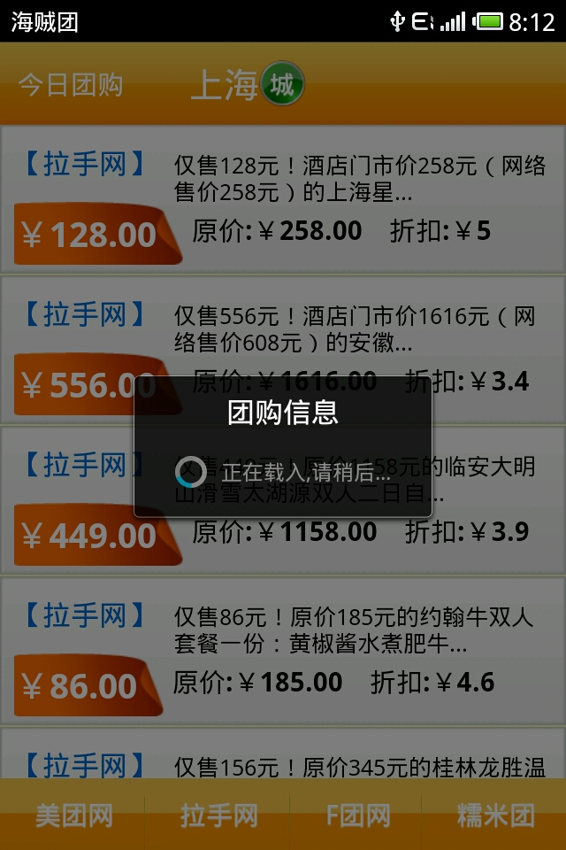
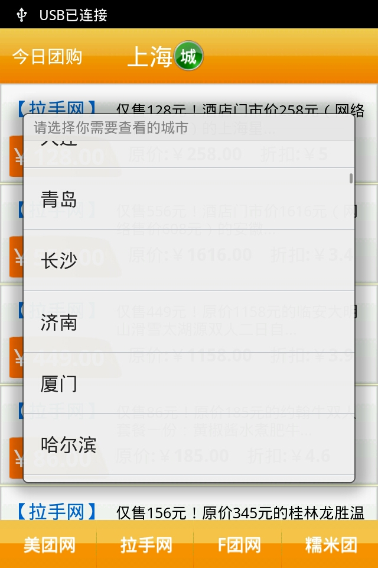
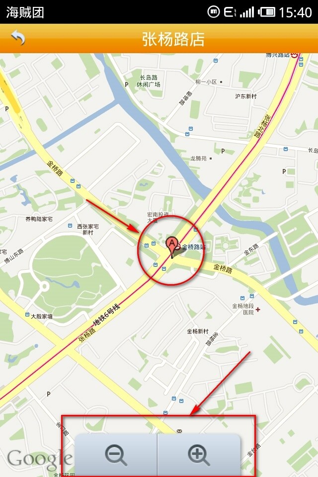
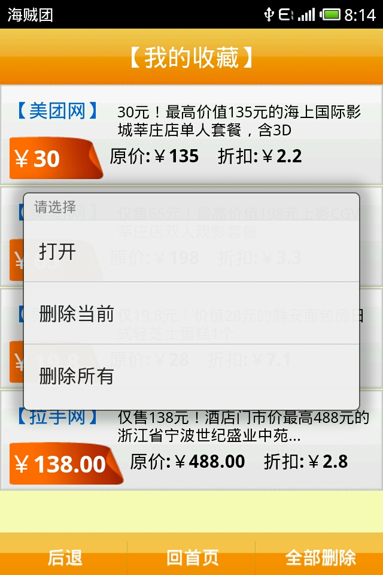

# Medium_02_E-commerce
2011 Google Android学术合作计划项目

# 关于

随着3G时代与后PC时代的到来，移动应用已越来越普及，特别是电子商务类应用正迅速的蔓延。移动设备的实时、快捷，为移动电子商务的发展带来有利条件。同时，Android作为近几年最火热的手机平台，其激活的手持设备在中国的市场份额也高居不下。项目设计开发了一个Android平台下移动电子商务客户端，主要实现功能如下：

1) 对各个网站提供的信息浏览查看，根据不同城市查看，可切换不同网站。

2) 对信息添加收藏，删除收藏，查看收藏等

3) 网上购买

4) 商铺地图浏览,商铺电话拨打

5) 好友分享，通过短信或者邮件

# 系统效果

